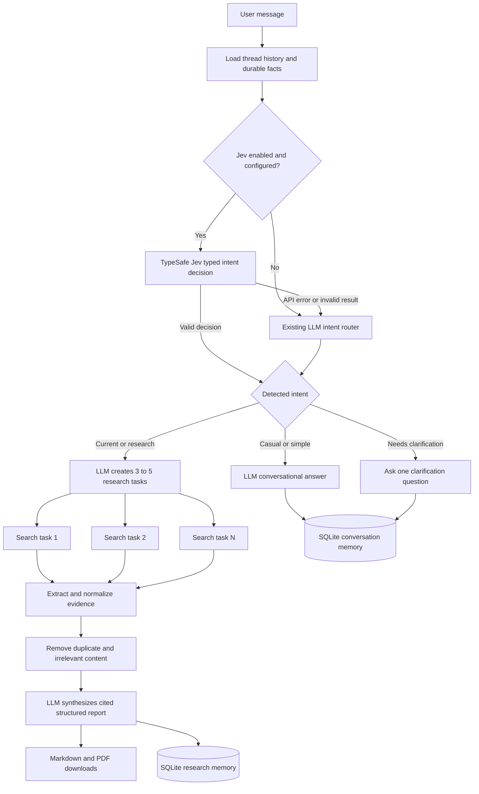
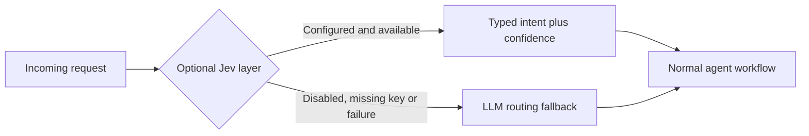
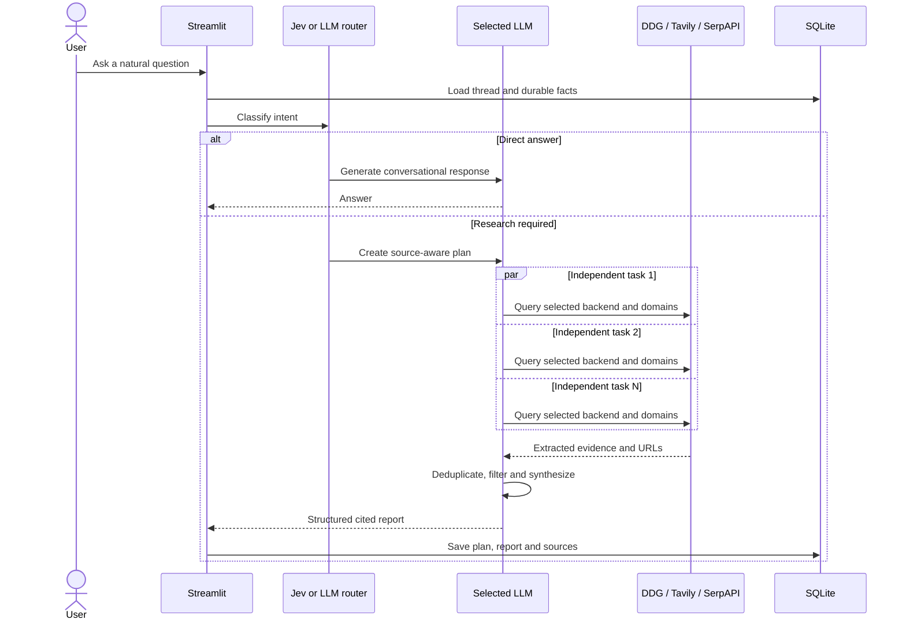
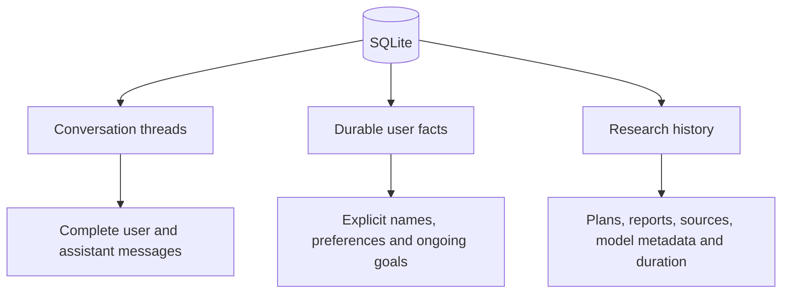

# 🔎 Multi-LLM Autonomous Research Agent

> A conversation-aware Streamlit agent that decides when research is needed, chooses suitable
> external sources, gathers evidence in parallel, removes duplication, writes a cited and
> actionable report, and remembers previous work.

## Project at a glance

| Capability | Included |
|---|:---:|
| ChatGPT-style persistent conversations | ✅ |
| OpenAI, DeepSeek, Gemini, Groq and custom LLMs | ✅ |
| Optional TypeSafe Jev decision routing | ✅ |
| Automatic fallback when Jev is unavailable | ✅ |
| Autonomous search backend and domain selection | ✅ |
| Parallel multi-source research | ✅ |
| Extraction, relevance filtering and deduplication | ✅ |
| Structured reports with clickable citations | ✅ |
| Markdown and PDF exports | ✅ |
| SQLite conversation, fact and research memory | ✅ |

## How the agent works



### Why Jev is optional

Jev is a TypeSafe System One decision model, not a long-form chat model. It handles the
small but important routing decision; the selected generative LLM still handles conversation,
planning and report writing.



- **With Jev:** typed classification and a confidence score are recorded in message metadata.
- **Without Jev:** the existing LLM router behaves exactly as before.
- **On failure or low confidence:** fallback is automatic; the user's request is not interrupted.
- **Separation of responsibilities:** Jev routes; OpenAI/Gemini/DeepSeek/Groq generate.

## Research pipeline



## Supported services

### Generative LLMs

| Provider | Default model | Environment variable |
|---|---|---|
| OpenAI / ChatGPT | `gpt-5.5` | `OPENAI_API_KEY` |
| DeepSeek | `deepseek-flash` | `DEEPSEEK_API_KEY` |
| Google Gemini | `gemini-3.8-flash` | `GEMINI_API_KEY` |
| Groq | `openai/gpt-oss-20b` | `GROQ_API_KEY` |
| Custom OpenAI-compatible API | User supplied | `CUSTOM_LLM_API_KEY` |

### Decision and search services

| Service | Role | Required? |
|---|---|:---:|
| TypeSafe Jev | Typed intent classification with confidence | No |
| DuckDuckGo | Key-free general web discovery | Built in |
| Tavily | Deep search with extracted content | No |
| SerpAPI | Google organic/current coverage | No |

## Autonomous source selection

When `SEARCH_BACKEND=auto`, the planner chooses for every task:

- the research angle and query;
- the preferred source types;
- authoritative domains;
- the most appropriate configured search backend.

The selection is operational, not decorative:

- Tavily receives native `include_domains` filters.
- DuckDuckGo and SerpAPI receive `site:` constraints.
- Unsupported backend choices fall back to the best configured provider.
- The **Research details** panel displays each decision for the evaluator.

## Assessment coverage

| Internship requirement | Project implementation | Status |
|---|---|:---:|
| Accept a query or topic | Streamlit chat input | ✅ |
| Search external sources | DuckDuckGo, Tavily and SerpAPI adapters | ✅ |
| Extract relevant information | Snippets plus readable webpage extraction | ✅ |
| Remove duplicate or irrelevant content | URL normalization, title similarity and synthesis filtering | ✅ |
| Key points | Fixed report section | ✅ |
| Important findings | Fixed report section | ✅ |
| References and sources | Clickable source-ID citations | ✅ |
| Actionable insights | Fixed report section | ✅ |
| Autonomous source selection | Per-task source type, domain and backend decisions | ✅ |
| Parallel information gathering | `ThreadPoolExecutor` worker pool | ✅ |
| Export PDF or Markdown | Streamlit download buttons | ✅ |
| Store previous searches | SQLite research and message history | ✅ |

## Quick start

<details>
<summary><strong>1. Install the project</strong></summary>

```powershell
python -m venv .venv
.venv\Scripts\Activate.ps1
pip install -r requirements.txt
Copy-Item .env.example .env
```

Python 3.11 or newer is recommended.

</details>

<details>
<summary><strong>2. Configure at least one generative LLM</strong></summary>

Example using Gemini:

```dotenv
GEMINI_API_KEY=your_key_here
LLM_PROVIDER=gemini
```

API keys may instead be entered in the Streamlit sidebar for the current session.

</details>

<details>
<summary><strong>3. Optionally enable TypeSafe Jev</strong></summary>

```dotenv
JEV_ENABLED=true
JEV_API_KEY=your_key_here
JEV_MODEL=jev-latest
JEV_BASE_URL=https://api.typesafe.ai
JEV_MIN_CONFIDENCE=0.60
```

If Jev is disabled, has no key, falls below the confidence threshold, times out or returns
an invalid result, the existing LLM router automatically takes over.

</details>

<details>
<summary><strong>4. Optionally configure premium search providers</strong></summary>

```dotenv
SEARCH_BACKEND=auto
TAVILY_API_KEY=
SERPAPI_API_KEY=
MAX_PARALLEL_SEARCHES=4
```

DuckDuckGo remains available without a search API key.

</details>

<details open>
<summary><strong>5. Run the application</strong></summary>

```powershell
.venv\Scripts\python.exe -m streamlit run app.py
```

Open `http://localhost:8501`.

</details>

## Suggested live demonstration

Ask the agent a natural question:

> I live in India and have a budget of ₹20 lakh. Which electric car should I buy in 2026
> for daily city driving and occasional highway trips?

Then demonstrate:

1. The intent and decision router shown below the answer.
2. Parallel tasks, selected backends, domains and source types in **Research details**.
3. The structured report and clickable citations.
4. Markdown and PDF downloads.
5. Persistence by restarting the app and reopening the conversation.

## Memory model



- Thread messages are isolated by conversation.
- Explicit durable facts may be reused across conversations.
- Secrets such as API keys and passwords are rejected from long-term fact memory.
- Completed research remains available after an application restart.

## Project structure

```text
app.py                         Streamlit interface and thread orchestration
research_agent/
  agent.py                    Routing, planning, parallel gathering and synthesis
  jev.py                      Optional TypeSafe Jev typed-decision adapter
  providers.py                Multi-provider generative LLM adapter
  search.py                   DuckDuckGo, Tavily, SerpAPI and page extraction
  memory.py                   SQLite conversations, facts and research history
  models.py                   Shared data models
  deduplication.py            URL and title-based source deduplication
  exporters.py                Markdown and PDF generation
tests/                         Automated unit and workflow tests
PROJECT_CONTEXT.md             Recovery and maintenance context
```

## Verification

```powershell
.venv\Scripts\python.exe -m compileall -q app.py research_agent tests
.venv\Scripts\python.exe -m pytest -q
```

- External LLM, Jev and search API calls are mocked in automated tests.
- Tests do not consume paid API credits.
- See `PROJECT_CONTEXT.md` for the latest verified test count and known limitations.

## Technical references

- [TypeSafe Jev API](https://api.typesafe.ai/docs)
- [TypeSafe System One Models and Jev](https://typesafe.ai/blog/introducing-system-one-models-and-jev)
- [Google Gemini OpenAI compatibility](https://ai.google.dev/gemini-api/docs/openai)
- [DeepSeek API](https://api-docs.deepseek.com/)
- [Groq OpenAI compatibility](https://console.groq.com/docs/openai)
- [SerpAPI Google Search API](https://serpapi.com/search-api)
